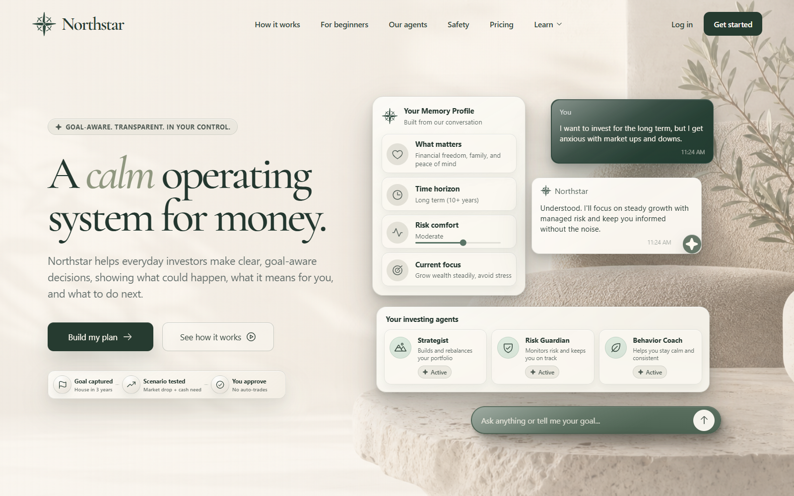
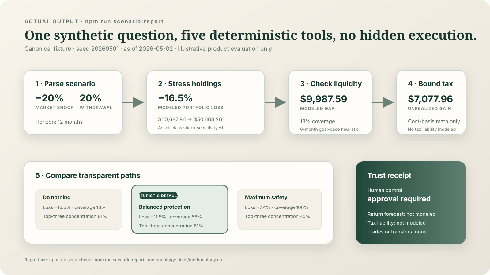
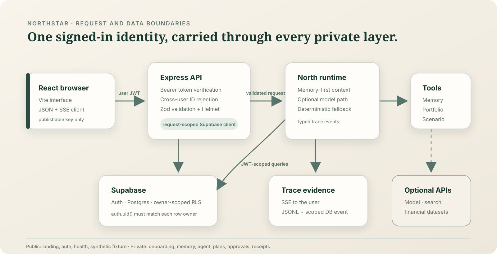

# Northstar

Northstar is a memory-first financial planning agent that turns a person's goals, liquidity needs, risk posture, and portfolio context into inspectable, approval-gated planning guidance.



Northstar was built for the Goldman Sachs AI Hackathon as a working product prototype—not an autonomous trading system. A user completes structured onboarding, North compiles durable memory, and the app can then explain goals, compare a synthetic market scenario, draft a plan, and show the tool trace behind its answer. It never places trades, moves money, or estimates a real tax liability.

## Why this is more than a chat UI

- **Durable context:** onboarding produces both a human-readable `memory.md` representation and a compact context packet.
- **Inspectable reasoning:** agent runs stream typed events over SSE and mirror traces to JSONL and Supabase.
- **Deterministic evaluation:** the checked-in synthetic fixture and scenario math reproduce from a fixed seed and as-of date.
- **Human control:** recommendations can be staged and approved or rejected; financial execution is outside the product boundary.
- **Defense in depth:** private API routes verify Supabase access tokens, reject cross-user IDs, and rely on owner-scoped Postgres RLS.

## Product flow



1. Register or sign in through Supabase Auth.
2. Connect the synthetic account fixture and complete onboarding.
3. Compile goals, risk, tax context, preferences, and approval boundaries into memory.
4. Ask North a planning question or run the fixed market-drop/withdrawal scenario.
5. Inspect tool calls, assumptions, path comparison, and the trust receipt before approving anything.

## Architecture

Northstar is an npm workspace with a React/Vite client, an Express API, shared TypeScript contracts, a Python fixture generator, and Supabase Auth/Postgres. The API creates a request-scoped Supabase client from the signed-in user's JWT; RLS remains the final data boundary.



See [the architecture notes](docs/architecture.md) for runtime boundaries, data flow, and security decisions.

## Engineering decisions

| Decision | Why | Tradeoff |
| --- | --- | --- |
| Memory before agent execution | Prevents a blank chat from inventing user context | Onboarding is longer than a typical chatbot start |
| SSE event stream | Makes tool progress visible without waiting for one final response | The client must handle partial events and reconnect failures |
| Signed-in, request-scoped Supabase client | Preserves the user's JWT all the way to RLS | Every private request needs a valid access token |
| Deterministic scenario fallback | Gives reviewers a repeatable path when external model/data keys are absent | It is a heuristic simulation, not a market forecast |
| No execution tools | Matches the prototype's safety boundary | Northstar prepares decisions but cannot complete them |

The scenario math and its limitations are documented in [methodology](docs/methodology.md). Source and data decisions are recorded in [research](docs/research.md) and [data provenance](docs/data-provenance.md).

## My contribution

Northstar was co-built with [Kushagra Bharti](https://github.com/KushagraBharti). Git history attributes the initial workspace, early memory graph, Supabase foundations, agent runner, and original demo deck primarily to Kushagra. My commits cover much of the product integration and presentation layer: restoring and wiring the app routes, landing/auth refinement, navigation, onboarding gating, user-specific memory and agent surfaces, scenario behavior, goal mutations, and merge/build recovery.

For a commit-backed breakdown rather than an ownership claim, see [contributions](docs/contributions.md).

## Local setup

Prerequisites:

- Node.js 24+
- npm 11+
- Python 3.11+
- a Supabase project for authenticated persistence

```bash
git clone https://github.com/YuvrajKashyap/northstar.git
cd northstar
npm ci
npm run seed:check
```

Copy the two environment examples:

```bash
cp backend/.env.example backend/.env
cp frontend/.env.example frontend/.env
```

Required backend values:

```env
SUPABASE_URL=https://your-project.supabase.co
SUPABASE_PUBLISHABLE_KEY=sb_publishable_...
ALLOWED_ORIGINS=
```

Optional integrations:

```env
OPENROUTER_API_KEY=
FINANCIAL_DATASETS_API_KEY=
EXASEARCH_API_KEY=
```

`OPENROUTER_API_KEY` enables the live model path. The checked-in scenario and research-tool fallbacks remain explicitly labeled deterministic when optional keys are absent.

Apply the database migrations to a project you control:

```bash
npx supabase login
npx supabase link --project-ref <your-project-ref>
npx supabase db push
```

Run the frontend and API:

```bash
npm run dev
```

- Frontend: `http://localhost:5173`
- API health: `http://localhost:8787/api/health`

## Verification

```bash
npm run verify
npm audit --audit-level=low
```

`npm run verify` checks fixture reproducibility, lint, all three TypeScript projects, backend unit tests, and the production build. CI runs the same gate from a clean install.

## Prototype boundaries

- The account fixture is generated synthetic data. No real bank, brokerage, or Plaid account is connected.
- Scenario outputs are deterministic heuristics, not backtests, forecasts, recommendations, or measured user outcomes.
- Tax output is limited to cost-basis arithmetic; it does not model tax rates, filing status, holding period rules, or jurisdiction.
- The original Supabase project is not a verified public deployment, so this repository does not claim a live demo.
- Access tokens are currently stored in browser local storage. A production financial product should prefer hardened server-managed sessions and a full threat model.
- Northstar is a hackathon prototype and is not registered investment, legal, or tax advice.

## Repository map

```text
frontend/   React 19 interface, routing, onboarding, plans, scenarios, and trace UI
backend/    Express 5 API, auth boundary, agent runtime, tools, persistence, and tests
shared/     Shared TypeScript domain contracts
scripts/    Reproducible synthetic fixture generator
supabase/   Versioned schema and owner-scoped RLS migrations
docs/       Architecture, methodology, research, provenance, and contribution notes
screenshots/ Canonical portfolio and workflow captures from the running app
```

No open-source license is granted by this repository. Third-party services and libraries remain subject to their own terms.
