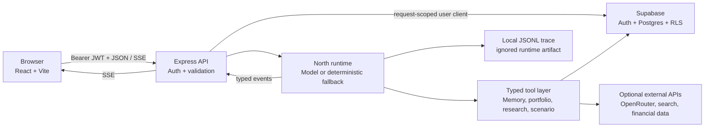

# Architecture

Northstar separates public product discovery from authenticated financial context. The browser never receives a privileged Supabase key. For private routes, the Express middleware verifies the bearer token with Supabase Auth, rejects a caller-supplied `userId` that differs from the token subject, and creates a request-scoped Supabase client carrying that same token. Postgres RLS then checks `auth.uid()` against each row's owner.

## Runtime paths

### Authentication and provisioning

1. Registration and login use the publishable Supabase key.
2. If registration returns a session immediately, the API provisions the user's synthetic fixture under that JWT.
3. If email confirmation is enabled, provisioning is deferred until the first successful login.
4. Profile and fixture rows use the Supabase Auth UUID as `user_id`, which is the value checked by RLS.

### Agent run

1. The API loads the user's memory and portfolio context.
2. `general` prefers a fast model path; `fresh_check` exposes current-data tools when their keys are configured.
3. Missing external credentials produce clearly labeled deterministic fallbacks rather than invented live results.
4. Events are streamed to the UI and appended to local JSONL. Database trace writes inherit the signed-in user's RLS scope.

### Synthetic scenario

The scenario route deliberately uses the checked-in fixture. It runs five pure tools—parse, stress, tax context, path comparison, and trust receipt—and labels the result synthetic. It may persist the receipt to the signed-in user's workspace, but it has no execution capability.

## Security invariants

- Public: health, auth endpoints, and the read-only synthetic fixture.
- Private: account import simulation, onboarding, memory, goals, plans, approvals, agent runs, receipts, and traces.
- The API rejects cross-user identity before business logic.
- RLS denies anonymous table access and scopes authenticated rows with `(select auth.uid())`.
- Secrets belong only in ignored `.env` files; the repo carries examples with blank values.
- CORS permits local Vite origins plus explicit `ALLOWED_ORIGINS` entries.
- Helmet supplies standard API security headers and Express does not advertise `X-Powered-By`.

## Known architectural limits

Local storage is used for the browser access token, and the project does not yet implement refresh-token rotation in the client. The JSONL trace mirror is useful for local inspection but is not a tamper-evident audit log. The API also has no distributed rate-limit store; Supabase Auth rate limits still apply to auth operations.
